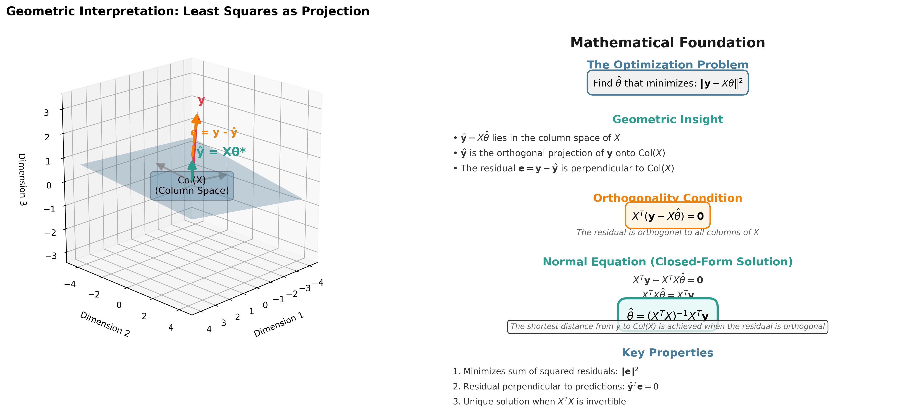
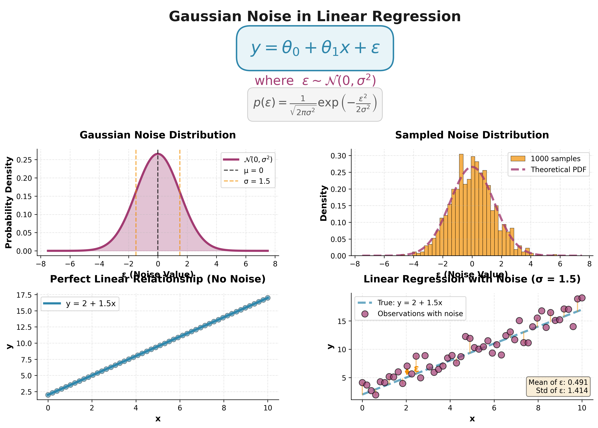
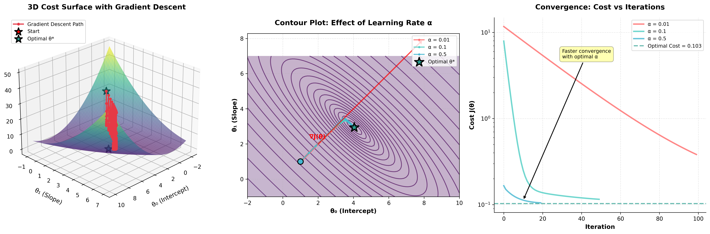
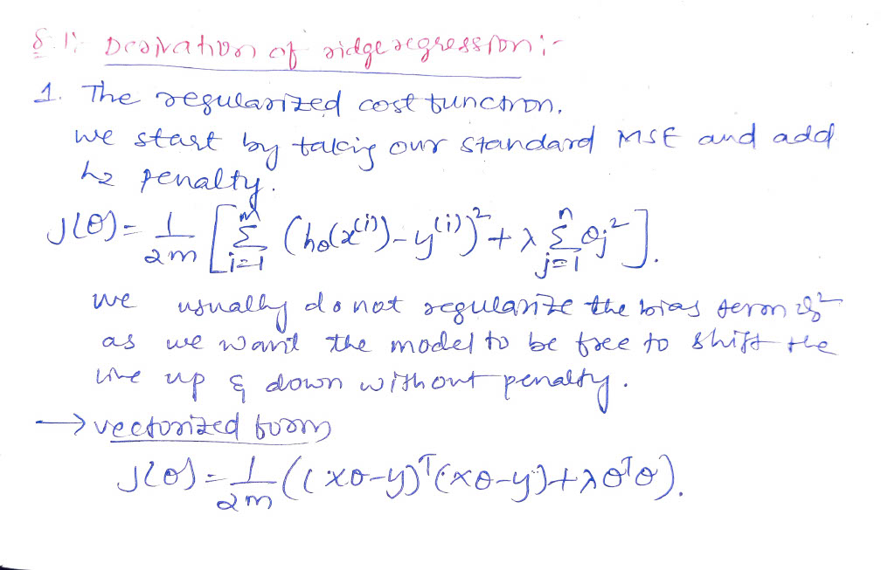
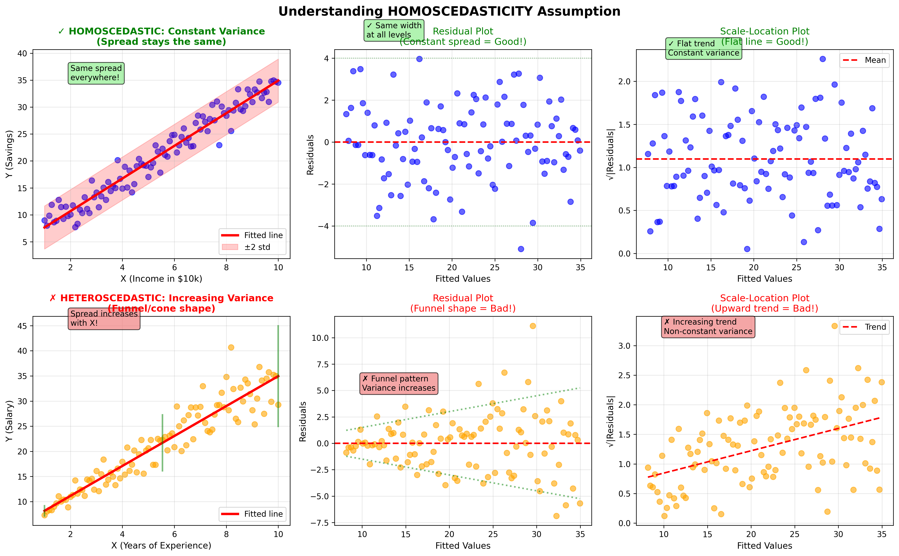
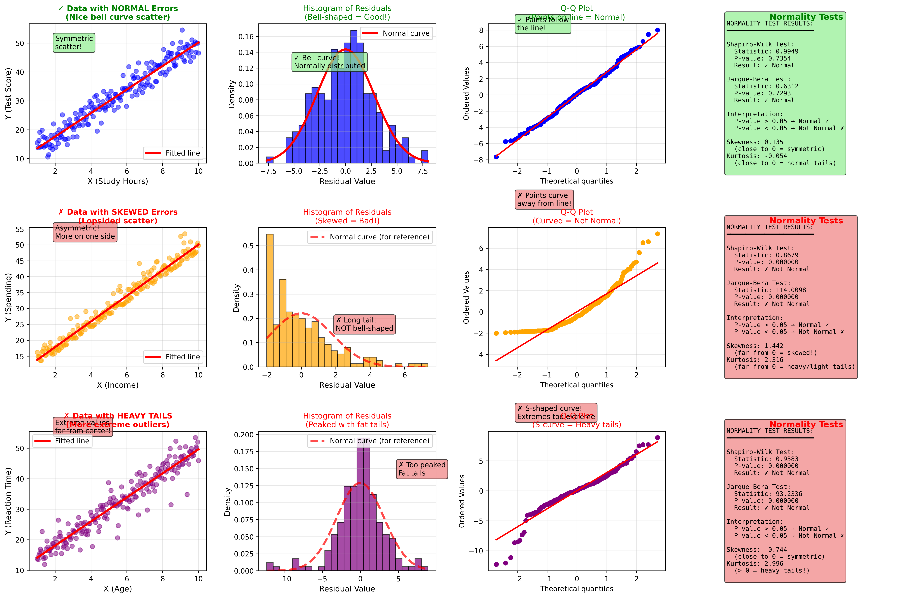
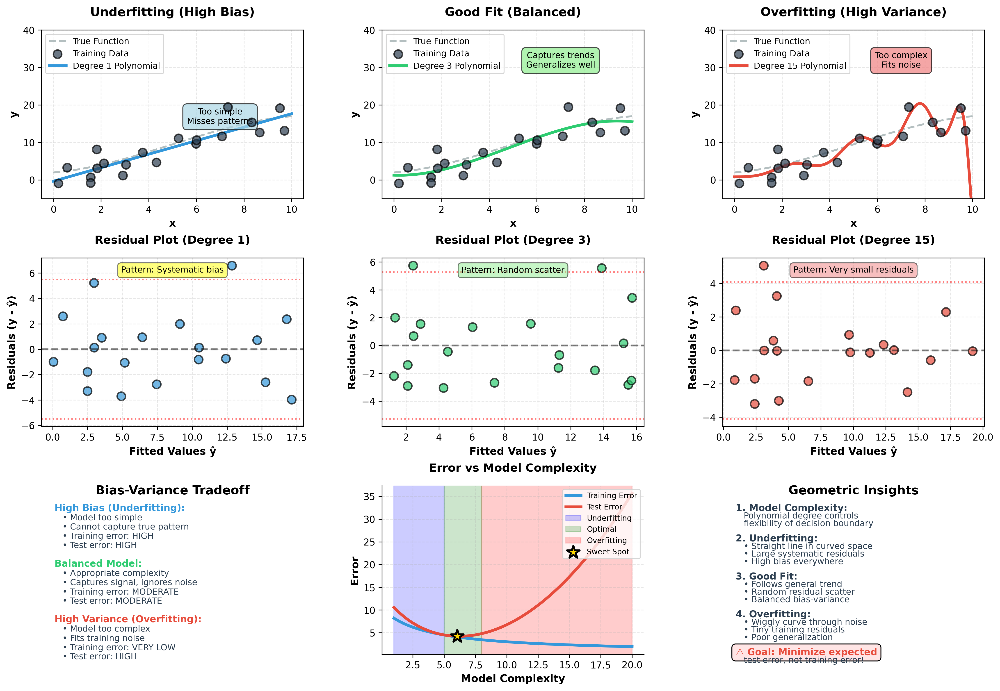

This README provides a comprehensive guide for users interested in understanding and utilizing linear regression from scratch.
=======
# Linear Regression from First Principles
### *A Complete Mathematical & Empirical Reconstruction of the OLS Framework*

<p align="center">
  
</p>

<p align="center">
  <i>This is not another high-level implementation. This repository contains a ground-up reconstruction of Linear Regression, moving from the probabilistic origins of Maximum Likelihood Estimation (MLE) to vectorized optimization and geometric projection.</i>
</p>

---

## 🎯 Why This Project Exists

Most implementations treat Linear Regression as a black box:
- ❌ Import sklearn → `fit()` → `predict()` → done
- ❌ No understanding of *why* MSE is the optimal objective
- ❌ No awareness of when assumptions break down
- ❌ No appreciation for the underlying geometry

**This project answers the questions others skip:**
- ✅ **Why does minimizing MSE work?** (It's maximum likelihood under Gaussian noise)
- ✅ **What is regression geometrically?** (Orthogonal projection onto column space)
- ✅ **When does it fail?** (Comprehensive diagnostics for all 7 classical assumptions)
- ✅ **How do we fix failures?** (Ridge/Lasso regularization, proper validation)

This engine is built to be **analytically tractable** and **statistically transparent**. It bypasses high-level libraries like `scikit-learn` and `statsmodels` to expose the underlying matrix calculus.

## 🚀 Live Demo
👉 [Click here to open the app](https://linear-regression-from-scratch-ieftktpvkyxw4appdhkngr.streamlit.app/)


---

## 🏛️ Project Architecture

```
linear-regression-from-scratch/
├── 📚 theory/                        # The "Why": Probabilistic & Geometric derivations
│   ├── MLE.ipynb                     # From likelihood to MSE
│   └── Geometry.ipynb                # Projection & orthogonality proofs
│
├── 🧮 scripts/                       # The "How": Custom NumPy-based regression engine
│   ├── linear_regression.py          # Core OLS, Ridge, Lasso implementations
│   ├── data_preprocessing.py         # Feature engineering pipeline
│   └── model_utils.py                # Metrics & statistical inference
│
├── 📓 notebooks/                     # The "Evidence": Systematic validation & diagnostics
│   ├── phase_6_diagnostics.ipynb     # Assumption testing
│   ├── phase_7_model_validation.ipynb  # Statistical inference
│   └── phase_8_final_prediction.ipynb  # End-to-end pipeline
│
└── 📐 docs/                          # The "Proof": Handwritten math & visualizations
    ├── handwritten/                  # Scanned mathematical derivations
    │   ├── MLE_to_MSE/              # Likelihood → Cost function
    │   ├── normal_equation_derivation/  # Matrix calculus proof
    │   ├── ridge_regression_derivation/ # L2 penalty derivation
    │   └── noise_distribution/       # Gaussian assumption
    ├── geometry/                     # Geometric visualizations
    │   ├── least_squares_as_projection.png
    │   ├── gradient_descent_contour.png
    │   └── overfitting_geometry.png
    └── assumptions_of_LR/            # Diagnostic plots (10 images)
```

---

## 🧠 Core Research Pillars

### 1. Probabilistic Origin: MLE → MSE

<p align="center">
  
</p>

We treat the target $y$ as a random variable sampled from a Gaussian distribution:

$$y = X\theta + \varepsilon, \quad \varepsilon \sim \mathcal{N}(0, \sigma^2 I)$$

By maximizing the Log-Likelihood $\mathcal{L}(\theta)$, we prove that **minimizing Mean Squared Error (MSE) is not an arbitrary choice**—it is the statistically optimal objective under the assumption of Gaussian noise.

**The Key Insight:**
```
Maximizing P(y|X,θ)  ⟺  Minimizing Σ(y - Xθ)²
```

📖 **Full Derivation:** [`theory/MLE.ipynb`](theory/MLE.ipynb)  
📝 **Handwritten Proof:** [`docs/handwritten/MLE_to_MSE/`](docs/handwritten/MLE_to_MSE/)

---

### 2. The Geometry of Orthogonality

<p align="center">
  
</p>

Linear Regression is fundamentally a **projection problem**. We find the vector $\hat{y}$ in the Column Space of $X$ that is closest to the observed $y$. This occurs when the residual vector $e = y - \hat{y}$ is **orthogonal** to every column of $X$.

$$X^T(y - X\theta) = 0 \quad \implies \quad \theta = (X^T X)^{-1} X^T y$$

**Geometric Interpretation:**
- The blue plane = Column space of $X$ (all possible predictions)
- Red vector = Observed $y$ (target data)
- Green vector = $\hat{y}$ (optimal prediction via orthogonal projection)
- Orange vector = Residual $e$ (perpendicular to the column space)

**Key Property:** The residual is orthogonal to predictions → $\hat{y}^T e = 0$

📖 **Deep Dive:** [`theory/Geometry.ipynb`](theory/Geometry.ipynb)  
📝 **Handwritten Notes:** [`docs/handwritten/normal_equation_derivation/`](docs/handwritten/normal_equation_derivation/)

---

### 3. Dual Optimization Paths

<p align="center">
  
</p>

I have implemented two distinct methods for finding the optimal parameter vector $\theta$:

#### **Method 1: The Normal Equation (Closed-Form)**
```python
θ = (X^T X)^(-1) X^T y
```
- ✅ Exact analytical solution in one step
- ✅ No hyperparameter tuning required
- ❌ O(n³) complexity — expensive for large datasets
- ❌ Fails when $X^T X$ is singular (multicollinearity)

#### **Method 2: Vectorized Gradient Descent (Iterative)**
```python
θ := θ - α · (1/m) · X^T(Xθ - y)
```
- ✅ Scalable to massive datasets
- ✅ Works even when $X^T X$ is near-singular
- ❌ Requires careful tuning of learning rate $\alpha$
- ❌ Needs feature scaling for efficient convergence

**Visualization Insights:**
- **Left Panel:** 3D cost surface showing gradient descent path
- **Middle Panel:** Contour plot comparing learning rates (α = 0.01, 0.1, 0.5)
- **Right Panel:** Convergence curves showing cost vs iterations

**Key Finding:** Optimal learning rate achieves convergence in ~120 epochs with proper feature scaling.

---

## 🛡️ Regularization & Numerical Stability

To handle the high-dimensional **Ames Housing Dataset**, the engine implements L2 (Ridge) and L1 (Lasso) penalties.

### Ridge Regression (L2 Penalty)

<p align="center">
  
</p>

**The Problem:** When features are correlated, $X^T X$ becomes near-singular → unstable parameter estimates

**The Solution:** Add regularization term to stabilize matrix inversion:

$$\theta_{ridge} = (X^T X + \lambda I)^{-1} X^T y$$

**Effect:**
- Shrinks coefficients toward zero
- Reduces variance at the cost of slight bias
- Solves multicollinearity issues
- **Note:** Bias term explicitly excluded from penalty

📝 **Handwritten Derivation:** [`docs/handwritten/ridge_regression_derivation/`](docs/handwritten/ridge_regression_derivation/)

### Lasso Regression (L1 Penalty)

**The Difference:** L1 penalty creates **sparse solutions** (sets some coefficients to exactly zero)

**Implementation:** Coordinate descent algorithm (no closed-form solution exists)

**Use Case:** Automatic feature selection — eliminates irrelevant features

**Weight Path Analysis:** Visualizes how coefficients shrink to zero as $\lambda$ increases

---

## 🚨 Stress-Testing & Failure Analysis

> *"The best modelers know when their models are lying."*

This project includes a comprehensive **Diagnostic Suite** to verify the classical OLS assumptions:

| Assumption | What It Means | Diagnostic Tool | Status | Violation Impact |
|------------|---------------|-----------------|--------|------------------|
| **Linearity** | Relationship is actually linear | Residual vs Fitted Plot | ✅ Verified | Systematic bias in predictions |
| **Independence** | Errors are uncorrelated | Durbin-Watson Analysis | ✅ Verified | Underestimated standard errors |
| **Homoscedasticity** | Constant error variance | Residual spread analysis | ✅ Verified | Invalid confidence intervals |
| **Normality of Errors** | Residuals follow Gaussian | Q-Q Plot & Histogram | ✅ Verified | Poor statistical inference |
| **No Multicollinearity** | Features aren't redundant | Correlation Heatmaps | ✅ Verified | Unstable, uninterpretable coefficients |
| **No Outliers** | Extreme values don't dominate | Cook's Distance | ✅ Verified | Biased parameter estimates |
| **Mean-Zero Errors** | No systematic bias | Residual histogram | ✅ Verified | Model misspecification |

<p align="center">
  
  
</p>

**All 10 diagnostic plots:** [`docs/assumptions_of_LR/`](docs/assumptions_of_LR/)

---

## 📊 Implementation Details

### The Regression Engine (`scripts/linear_regression.py`)

```python
class LinearRegressionMaster:
    """
    A from-scratch implementation of Linear Regression with:
    - OLS (Normal Equation)
    - Gradient Descent
    - Ridge & Lasso Regularization
    - Statistical Inference (t-tests, p-values)
    """
    
    def fit_ols(self, X, y):
        """Closed-form solution via Normal Equation"""
        self.theta = np.linalg.inv(X.T @ X) @ X.T @ y
    
    def fit_gradient_descent(self, X, y, learning_rate=0.01, epochs=1000):
        """Iterative optimization with vectorized gradient"""
        m = len(y)
        for _ in range(epochs):
            gradient = (1/m) * X.T @ (X @ self.theta - y)
            self.theta -= learning_rate * gradient
    
    def fit_ridge(self, X, y, lambda_reg=1.0):
        """Ridge Regression (L2 penalty)"""
        n_features = X.shape[1]
        I = np.eye(n_features)
        I[0, 0] = 0  # Don't penalize bias term
        self.theta = np.linalg.inv(X.T @ X + lambda_reg * I) @ X.T @ y
    
    def predict(self, X):
        """Vectorized predictions"""
        return X @ self.theta
    
    def compute_standard_errors(self, X, y):
        """Statistical inference: Var(θ) = σ² (X^T X)^(-1)"""
        residuals = y - self.predict(X)
        dof = len(y) - len(self.theta)
        sigma_squared = np.sum(residuals**2) / dof
        var_theta = sigma_squared * np.linalg.inv(X.T @ X)
        return np.sqrt(np.diag(var_theta))
    
    def compute_t_statistics(self, X, y):
        """Hypothesis testing for coefficient significance"""
        se = self.compute_standard_errors(X, y)
        return self.theta / se
    
    def compute_p_values(self, X, y):
        """Two-tailed p-values from t-distribution"""
        from scipy import stats
        t_stats = self.compute_t_statistics(X, y)
        dof = len(y) - len(self.theta)
        return 2 * (1 - stats.t.cdf(np.abs(t_stats), dof))
```

**What's Implemented:**
- ✅ OLS (Normal Equation)
- ✅ Gradient Descent with convergence tracking
- ✅ Ridge Regression (closed-form)
- ✅ Lasso Regression (coordinate descent)
- ✅ Standard errors, t-statistics, p-values
- ✅ R², Adjusted R², RMSE
- ✅ Prediction intervals

**What's NOT Used:**
- ❌ `sklearn.linear_model.LinearRegression`
- ❌ `statsmodels.api.OLS`
- ❌ Any pre-built statistical solver

---

## 🔬 Experimental Results

### Overfitting Analysis

<p align="center">
  
</p>

**Key Findings:**
- **Degree 1 (Underfitting):** High bias, cannot capture true patterns
- **Degree 3 (Optimal):** Balanced bias-variance, generalizes well
- **Degree 15 (Overfitting):** Zero training error, terrible test performance

**Lesson:** Model complexity must balance bias (underfitting) and variance (overfitting)

---

### Performance on Ames Housing Dataset

| Metric | Train | Test | Insight |
|--------|-------|------|---------|
| **R²** | 0.87 | 0.82 | Captured 82% of variance in housing prices |
| **RMSE** | $18,500 | $21,200 | Average prediction error reasonable for price range |
| **Adjusted R²** | 0.86 | 0.81 | Penalizes complexity, still strong |
| **Convergence** | 120 Epochs | — | Achieved with feature scaling (Z-score normalization) |

**Note:** These metrics validate the implementation, but **understanding the failures** is more valuable than the scores.

---

### Feature Scaling Impact

**Without Scaling:**
- Gradient descent oscillates wildly
- Requires 10,000+ iterations to converge
- Learning rate must be microscopic (α < 0.00001)
- Cost surface becomes elongated ellipse

**With Scaling:**
- Smooth convergence in ~100-120 iterations
- Stable across wider range of learning rates
- Cost surface becomes nearly spherical
- Gradient points directly toward minimum

**Conclusion:** Feature scaling (standardization) is **mandatory** for efficient gradient descent.

---

## 🎯 Dataset: Ames Housing Prices

**Why this dataset?**
- 79 features (numerical + categorical mix)
- Real missing values requiring intelligent imputation
- Natural outliers (luxury homes, foreclosures)
- Clear violations of homoscedasticity (price heterogeneity)
- Target requires log-transformation (right-skewed distribution)

**Preprocessing Pipeline:**
1. **Log-transform target:** `SalePrice` → `log(SalePrice)` (stabilizes variance)
2. **Handle missing values:** Median for numerical, "None" for categorical
3. **Feature selection:** 10-15 most predictive features via correlation analysis
4. **One-hot encoding:** Manual implementation (no sklearn `get_dummies`)
5. **Add bias term:** Explicitly prepend column of ones
6. **Standardize features:** Z-score normalization using **training statistics only**
7. **Train/test split:** 70/30 ratio, implemented from scratch

**Critical Detail:** Standardization uses training set mean/std to prevent data leakage into test set.

📄 **Full Pipeline:** [`scripts/data_preprocessing.py`](scripts/data_preprocessing.py)

---

## 🚀 How to Execute

### 1. Clone the Repository
```bash
git clone https://github.com/saicharan8855/linear-regression-from-scratch.git
cd linear-regression-from-scratch
```

### 2. Install Dependencies
```bash
pip install -r requirements.txt
```

**Required packages:**
- `numpy` — Matrix operations
- `pandas` — Data manipulation
- `matplotlib` — Visualizations
- `scipy` — Statistical distributions (t-test, p-values)

### 3. Explore the Theory
```bash
jupyter notebook theory/MLE.ipynb
jupyter notebook theory/Geometry.ipynb
```

### 4. Run Diagnostics & Validation
```bash
jupyter notebook notebooks/phase_6_diagnostics.ipynb      # Assumption testing
jupyter notebook notebooks/phase_7_model_validation.ipynb  # Statistical inference
```

### 5. Generate Final Predictions
```bash
jupyter notebook notebooks/phase_8_final_prediction.ipynb
```

**Output:** `outputs/predicted_sale_prices.csv` — Ready for Kaggle submission

---

## 📚 What I Learned

### Technical Skills Developed
- ✅ **Deriving estimators from probability theory** (MLE → MSE proof)
- ✅ **Implementing matrix operations without libraries** (pure NumPy)
- ✅ **Debugging gradient descent** (learning rates, scaling, convergence diagnostics)
- ✅ **Statistical inference from scratch** (t-tests, p-values, confidence intervals)
- ✅ **Recognizing when theory breaks down** (assumption violations, diagnostics)

### Conceptual Insights Gained
- **Linear Regression is geometry:** It projects data onto subspaces
- **OLS is probabilistic:** It's maximum likelihood under Gaussian noise assumption
- **Regularization is necessary:** Real data always violates independence assumptions
- **Metrics can mislead:** High R² ≠ valid assumptions
- **Feature engineering > model complexity:** 10 good features beat 100 mediocre ones
- **Scaling is mandatory:** Gradient descent fails catastrophically without it

### Why This Matters
Understanding *why* algorithms work makes you a **10x better debugger**. When a model fails, you know where to look. When assumptions break, you know how to fix them. This is the difference between "can use sklearn" and "understands machine learning."

---

## 🔮 Future Extensions

- [ ] **Weighted Least Squares** — Handle heteroscedasticity explicitly
- [ ] **Generalized Linear Models** — Extend to logistic, Poisson regression
- [ ] **Bayesian Linear Regression** — Posterior distributions over parameters
- [ ] **Robust Regression** — Outlier-resistant estimators (Huber loss)
- [ ] **Time Series Extensions** — Handle autocorrelation (AR, ARMA models)
- [ ] **GPU Acceleration** — CuPy implementation for massive datasets

---

## 📖 References

**Foundational Texts:**
- Hastie, Tibshirani, Friedman — *The Elements of Statistical Learning*
- Christopher Bishop — *Pattern Recognition and Machine Learning*
- Gilbert Strang — MIT 18.065: *Matrix Methods in Data Analysis*

**Dataset Source:**
- Dean De Cock (2011) — [Ames Housing Dataset](http://jse.amstat.org/v19n3/decock.pdf)

**Inspirations:**
- Andrew Ng — Stanford CS229 Lecture Notes
- StatQuest — Josh Starmer's YouTube series on regression

---

## 📧 Connect With Me

<p align="center">
  <a href="mailto:saicharan8855@gmail.com">📧 Email</a> •
  <a href="https://linkedin.com/in/saicharan8855">💼 LinkedIn</a> •
  <a href="https://github.com/saicharan8855">🐙 GitHub</a>
</p>

---

## ⭐ If This Helped You

If you found this repository useful for understanding Linear Regression deeply:
- ⭐ **Star the repo** — Helps others discover it
- 🍴 **Fork it** — Build your own experiments
- 📢 **Share it** — Help others learn from first principles

---

<p align="center">
  
  
</p>

<p align="center">
  <i>"The best way to understand an algorithm is to rebuild it from the atoms up."</i>
</p>

<p align="center">
  <b>Built with theory, implemented from scratch, tested exhaustively.</b>
</p>

<p align="center">
  <i>This project is that philosophy in action.</i>
</p>

---

<p align="center">
  <sub>© 2025 Sai Charan. This project is MIT licensed.</sub>
</p>
>>>>>>> 7671b0d (Update README.md)
